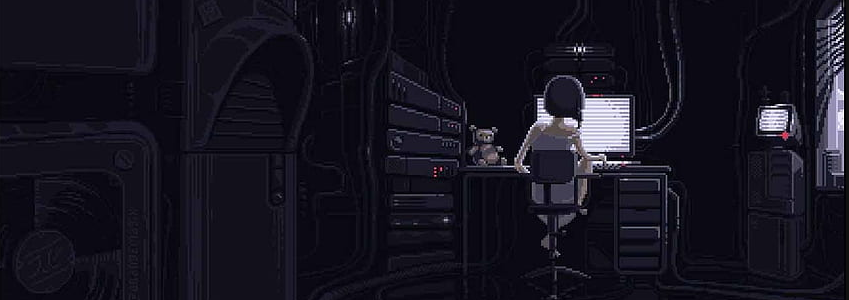

  
    
  
  
  
  
  

# About Me
- Currently focused on the Linux kernel, hardware, and related areas.
- I am not yet satisfied with where I stand.
- I will continue to grow.
- I am an introvert.

# Current Interests
- Backend development and home labs.
- Factory defaults? Not for me—I value freedom.
- Building hardware and using Linux-based operating systems.

# Devices & Operating Systems

- ROG Strix G614JU | EndeavourOS Linux 
- Thinkpad X260 | Arch Linux
- Thinkcentre m710q | Ubuntu Server
- Oppo A37F | PostmarketOS 
